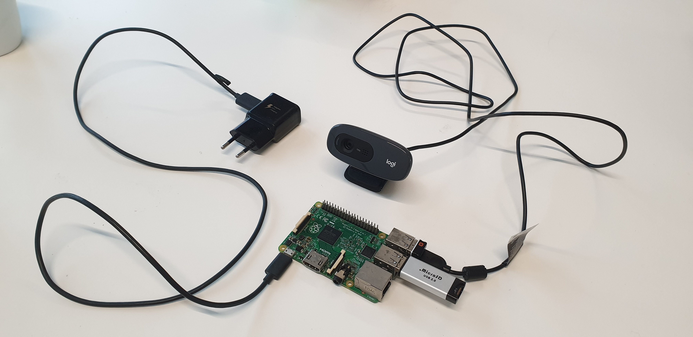
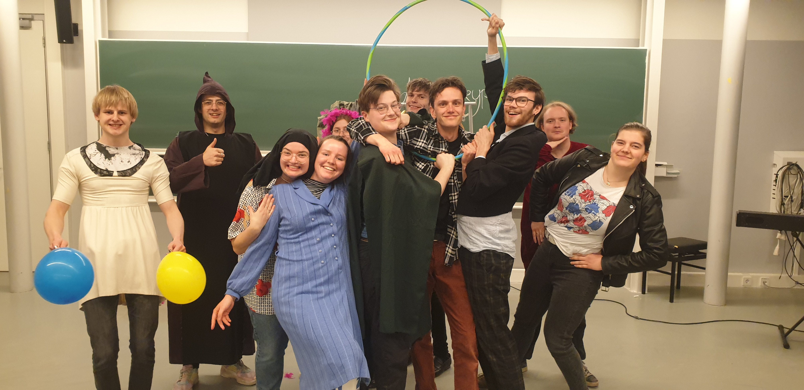

# Using Improvised Theatre to generate entropy for the KZG contribution

This blog post describes the process of generating and submitting entropy to the Ethereum KZG ceremony. It is part of the [KZG Ceremony Grant Round](https://blog.ethereum.org/2022/12/15/kzg-ceremony-grants-round).

## Introduction
We are a group that is part of [Doppio](https://doppio.nl/), the Student Theatre Association in Eindhoven. One aspect of theatre is improvisation, a common form of which is Theatre Sports. The idea is to play short scenes, by using theatre 'games', forms or gimmicks that the scene should adhere to.

The fun part of theatre sports is that actors create something new that is bigger than the sum of their parts. Nobody can predict beforehand how a scene will go. Even the subjects are based on prompts that are thought of on the fly. At the same time, it is impossible to reconstruct exactly what happened afterwards. This makes it ideal for entropy generation and subsequent destruction. See the [original proposal](https://gist.github.com/ThomasdenH/f7bb19d696283378a0f4157f043cf486) for the full motivation.

## The Setup
For the setup, we used a Raspberry Pi 2 Model B V1.1 which was fully airgapped (i.e. no ability to connect to the Internet). It doesn't have any internal permanent storage, for this a Micro-SD card was used. To the Pi, a webcam was connected that captured frames which were collected into a hash. The source code for this program can be found in [its repository](https://github.com/ThomasdenH/webcam-entropy). For the contribution client, Ignacio's [`go-kzg-ceremony-client`](https://github.com/jsign/go-kzg-ceremony-client) was used. These programs were both compiled on the Pi itself. A screen as well as a mouse and keyboard were connected to the Pi, as well as a USB-stick (which was actually a Micro SD to USB adapter) that was used to move the contribution itself.


*The above shows the configuration of the Raspberry Pi, the subsequent day, now lacking its Micro-SD card permanent storage. The USB ports contain the Micro SD adapter used as USB stick, the webcam and the wireless USB connector for the keyboard and mouse.*


## The Process
After our rehearsal, we started downloading the current Ceremony state by running
```bash
$ kzgcli offline download-state current-transcript.json
```
The current state was subsequently moved to the USB stick and transferred to the Pi. We then ran the webcam program to start capturing input. We performed two scenes. First, a 'revolving door' and secondly a 'soap'. We performed them in two groups, using suggestions by the others to inform which scenes to play.

The former is a scene where four people stand in a square formation. At any time, there are two people in front who play their scene. Whenever they want, a designated person can shout a rotation, say '+1' or '-2', after which the square rotates and another scene is continued. The goal is to make four funny or interesting scenes and bring them to a satisfying end.

The latter follows the structure of a soap-opera. There are many characters who all have their own drama. The challenge here is to still find an encompassing story together. To make it even more interesting, we made it an instance of 'Ga je dat nou zingen?', where any person can ask another 'Are you going to sing that?' whereafter the other immediately starts singing. For this, live accompanyment on the piano was done.


*The above is a picture of the group, right before starting. On the right, the piano can be seen that we used to add music to the performance.*

To convince you even more that this did all actually happen,  The sound was recorded through a phone recorder, obviously not connected to the Pi, and as such is sufficiently uncorrelated with the entropy that was used for the contribution.

After this was done, the collected entropy was collected from the localhost using the command
```bash
$ kzgcli offline contribute --urlrand http://localhost:3030 current-transcript.json new-transcript.json
```
computing the contribution took well over half an hour on the Pi.

Afterwards, the contribution was again transferred using the USB stick and moved to the network-connected laptop. Finally, by logging in to the sequencer and uploading the contribution by running
```bash
$ kzgcli offline send-contribution --session-id <your-session-id-here> new-transcript.json
```
the contribution was completed.

## Destroying the entropy
The entropy was never on the disk of the Pi, only in its temporary memory. Despite this, to be sure, the Micro SD that was used as the internal storage of the Pi was taken and destroyed. It was first broken into many pieces and subsequently grinded using a rock. The Micro SD adapter that was used to move the entropy was fully formatted afterwards.

## Our contribution
Our contribution no. is 83336. We contributed with address
```
0xb70aa3d2b6DfcaA804C45ED0bFeb785562dB42Dc
```
Our Powers of Tau public keys are:
```
(2^12): 
0x93d7ba163530c3d6f70b3f89d0bdd4986e53aad52d2279c75ee967ee080f32209a960a7d3070c41b1c94db0e4633c30c1814da27415289f989a524602c3455f8d82756b2c8c9f2e77a2c4e8bc2460ef137fcc3c5f46d4f16b1ab39b1345ac697

(2^13): 
0x87ed4d56364f6348fab07a27c6676f540ab9cddce390efcf9ee84b9cca2a0ec391be5bcfaae127259dfdc6388680dd75084c99df9dfe27dc089fc8016bc0079e36ea94536056f2712e4c7644f7366c2467b8d4a8f4bf0351473443d78f9de5b8

(2^14): 
0x8cc3102e8439e4e755544183af743914aec47e341a0a13b2ff857939fd16e0da7f3e741266192ed565e26dde3bca9a17192556efe0c54bacf20826a50cc7478c06fe5c15b379be2d96719db87435ff6622bfc699f77a09a9e86e0ff843cb28bf

(2^15): 
0xb46c6e844ca35349147f6dbf3bcde313c84cb9992d9593d842dc254220219ec75fb255ce45f762873ed60208ae6ba0c200ac0cca920f15b2250c4c21b8e1793d6fd26810b87559f0516fc28e80620318e83b1afbcda0cb3beb6f4b32e48fa811
```

